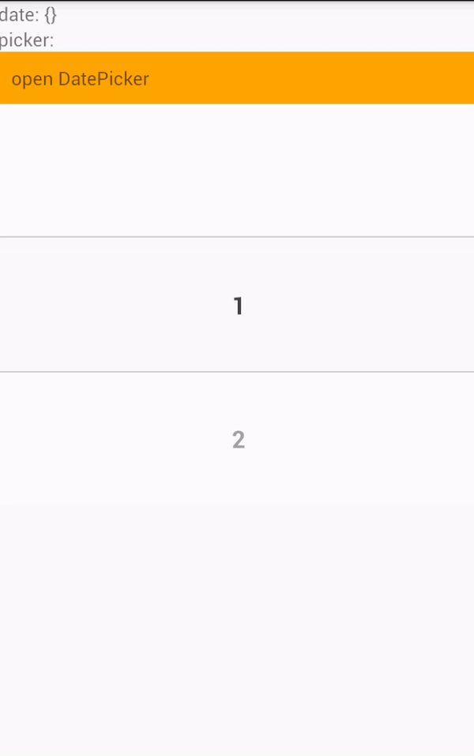

# react-native-select-picker

 A useful select picker, help you finish you app fast.

### Demo


### Install

```
npm install react-native-select-picer --save
```


### Usage 

```
import {SelectPicker, DatePicker} from 'react-native-select-picker';

import React, { Component } from 'react';
import {
  StyleSheet,
  Text,
  View,
  TouchableOpacity
} from 'react-native';

export default class App extends Component<{}> {

  constructor (props) {
    super(props);
    this.state = {
      date: {},
      picker: ''
    }
  }

  componentDidMount () {
    this.DatePicker.show();
  }

  valChange  = (item, index) => {
    console.log('值改变', item, index);
    this.setState({
      picker: item
    })
  }

  dateValChange = (year,month, day, hour, minute) => {
    console.log({year,month, day, hour, minute});
    var dateObj = {year,month, day, hour, minute};
    this.setState({
      date:dateObj
    });
  }

  render() {
    var {date, picker} = this.state;
    console.log(this.state, 111);
    var date = JSON.stringify(date);

    return (
      <View style={styles.container}>
        <Text>
          date: {date}
        </Text>
        <Text>
          picker: {picker}
        </Text>
        <TouchableOpacity style={{backgroundColor: 'orange', padding: 10}} onPress={() => this.DatePicker.show()}>
          <Text>open DatePicker</Text>
        </TouchableOpacity>
        <SelectPicker 
          onValueChange={this.valChange}
        />
        <DatePicker ref={(ref) => this.DatePicker = ref}
          ok= {this.dateValChange}
        />

      </View>
    );
  }
}

const styles = StyleSheet.create({
  container: {
    flex: 1
  },
  welcome: {
    fontSize: 20,
    textAlign: 'center',
    margin: 10,
  },
  instructions: {
    textAlign: 'center',
    color: '#333333',
    marginBottom: 5,
  },
});
```

#### SelectPicker Config

Just a select picker.

|prop         |type           |defaut                      |description                              |
|:----------   |:---------------|:-------------               |:-----------------------------------------|
|wrapHeight   |Number         |300                         | The height of picker container          |
|wrapWidth    |Number or null |null                        | The width of picker container, if the value is 'null', the wrapWidth is the parent's width, if the parent is root element, the wrapWidth is screen width|
|itemHeigh    |Number         |100                         | The height of item heiht, which can be selett|
|fontColor    |String         | '#444’                     | Font color |
|borderStyle  |Object         | {}                         | Border style |
|maskercolor  |String         | 'rgba(255, 255, 255, 0.5)' | The mask color of SelectPicker|
|data         |Array          | [1,2,3,4,5,6,7]            | the picker list items |
|onValueChange|Function       | function (item, index)     | When select picker value  change, this function will be call|

#### DatePicker Config

A date picker.

|prop         |type           |defaut                      |description                              |
|:----------   |:---------------|:-------------               |:-----------------------------------------|
|defaultTime  |Date Object    |new Date()                  |The default DateTime                    |
|title        |String         |'选择时间'                   |topBar text |
|titleStyle    |Object         |{}                      | ---|
|okText       |String         | '确定'                     | the right button text|
|okTextStyle  |Object         | {}                         | ---- |
|okBtnBgColor  |String         | 'rgba(255, 255, 255, 0.5)' | ----|
|cancelText       |String         | '取消'                     | the left button text|
|cancelTextStyle  |Object         | {}                         | ---- |
|cancelBtnBgColor  |String         | 'rgba(255, 255, 255, 0.5)' | ----|
|ok                | Function | function (year, month, day, ,hour, minute) {} | When click ok button, this function will be call.|
|cancel                | Function | function () {} | When click cancel button, DatePicker will be hidden. and you can do some thing in this function|
|customTopBar | Component Function | function (ok, cancel) {return null;} |You can custom topBar use this prop, return a React Component, args 'ok'  and 'cancel'  are function ,just like props 'ok' and 'cancel' |

#### DatePicker Methods

##### show()
you use this method to open DatePicker.

Example 
```
componentDidMount () {
   this.DatePicker.show();
}

<DatePicker ref={(ref) => this.DatePicker = ref}
  ok= {this.dateValChange}
/>
```

#### Final
 Good Luck!  
 :)

### License 
MIT